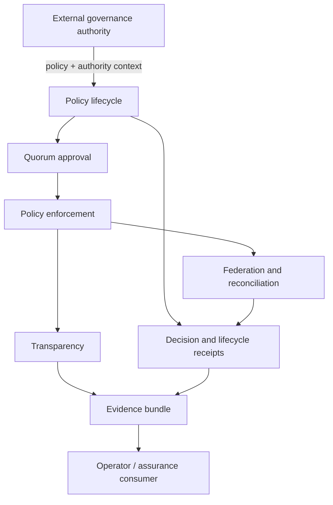

# PolicyMesh

PolicyMesh is an **executable policy-governance substrate** for bounded trust domains. It combines policy lifecycle control, quorum governance, signed policy feeds, reconciliation, trust anchors, decision receipts, transparency checkpoints, registry interchange, and portable assurance evidence.

## What PolicyMesh solves

Distributed trust systems need more than a policy document. They need deterministic answers to questions such as: which policy state is active, who approved it, what changed, whether a peer has diverged, whether an anchor was valid at a relevant time, why an update was accepted or rejected, and what evidence can be independently reviewed later. PolicyMesh turns those governance operations into explicit machine-verifiable artifacts.

## Authority boundary

PolicyMesh **does not create external governance legitimacy**. It executes, propagates and evidences policy within a declared authority context. A trust framework, institution, community, registry, agent mandate or other governance source remains authoritative for the legitimacy of the policy it supplies. `authority_context` can be retained with a policy update as evidence of what was presented, but PolicyMesh does not independently prove that mandate legitimate.

## Who should use it

PolicyMesh is intended for implementers and governance engineers evaluating small federations, trust registries, policy-controlled claim exchange, agent or service authorization environments, and assurance workflows that need replayable evidence of policy decisions.

## First result

Install the project and run the fully offline Travel & Hospitality reference example:

```bash
python -m venv .venv
source .venv/bin/activate
pip install -e . pytest
python examples/travel-hospitality/run.py all
```

You should see a set of `PERMIT`, `DENY` and `DEFER` decisions for an autonomous hotel-booking agent, with an Action Decision Receipt written for each scenario. This is the fastest way to see PolicyMesh as a business-facing decision substrate rather than only as federation infrastructure.

Then validate the complete repository:

```bash
pytest
python scripts/validate_repository.py
links --help
```

For a governed policy-lifecycle workflow, use explicit transitions and reconciliation:

```bash
links policy transition update.proposal.json --to-state approved --out update.approved.json
links policy transition update.approved.json --to-state active --out update.active.json
links policy reconcile --local local.json --remote remote.json --village-id example
links evidence build --village-id example --event-id evt-001 --source artifacts/reconciliation/example/report.json
```

## How to adopt PolicyMesh

Start with one bounded decision domain, keep upstream authority in the systems that already own it, and use PolicyMesh to evaluate the locally applicable policy and retain evidence. The new [Getting started](docs/getting-started.md) guide explains the recommended adoption sequence and the distinction between policy-admission decisions and application-action decisions.

The [Travel & Hospitality reference example](examples/travel-hospitality/README.md) is the recommended first implementation walkthrough. Then use the [worked-example portfolio](examples/README.md) and [PolicyMesh for personal-agent governance](docs/concepts/personal-agent-governance.md) to see the same decision substrate applied to shopping, healthcare and insurance agents.

## Architecture



The critical separation is: **authority is supplied by the governance context; PolicyMesh executes and evidences the resulting policy controls.**

## Relationship to DTG work

PolicyMesh is an **adjacent executable-policy and assurance laboratory** for work across the Trust over IP Decentralized Trust Graph (DTG) domain. It is not a DTG protocol, governance authority, authorization specification, or official DTG implementation.

A useful separation is:

- DTG credentials and proofs can supply verified evidence or predicates;
- Trust Tasks can describe a governed action being attempted;
- Trust Ceremonies can supply evidence that required governance interactions occurred;
- authority or delegation systems can supply scope and constraints;
- **PolicyMesh evaluates locally authoritative policy and emits an allow/deny/defer decision plus reviewable evidence**;
- RAHP and other assurance work can use those executable decisions and tests as feedback.

This makes PolicyMesh useful for asking whether emerging governance semantics are sufficiently precise to **implement, enforce, evidence, revoke and pressure-test** without PolicyMesh silently acquiring upstream authority.

See [PolicyMesh and the DTG work](docs/interoperability/dtg.md) for the complete relationship and non-authority boundaries.

## Core capabilities

- governed `proposal → approved → active → rolled_back` policy lifecycle;
- weighted, role-based and M-of-N quorum validation;
- signed policy feed manifests, pagination, lineage recovery and fork detection;
- deterministic reconciliation with durable evidence;
- trust-anchor registration, rotation, revocation and historical inspection;
- signed transparency checkpoints and drift classification;
- JSON/CSV audit export and decision receipts;
- explicit external-registry validate/diff/apply-defer-reject workflow;
- cryptographic algorithm lifecycle (`supported`, `deprecated`, `prohibited`);
- portable evidence bundles with independent digest verification;
- stable SDK/capability surfaces and deployment profiles.

## Evidence

PolicyMesh is designed to leave reviewable artifacts rather than only terminal output. Depending on the workflow, evidence includes lifecycle events, policy history, quorum inspection reports, reconciliation reports, signed manifests/checkpoints, denial artifacts, audit exports, registry-import receipts and `policymesh.evidence.v1` evidence bundles.

The repository-level validation contract is:

```bash
pytest
python scripts/validate_repository.py
```

Machine-readable control and evidence mappings are in [`assurance/`](assurance/).

## Project status

PolicyMesh v0.19.0 is an **implementation draft under active validation**. It is suitable for experimentation, interoperability testing and small-federation pilots. It does **not** assert production certification, independent assurance, universal policy authority or the legitimacy of an external mandate. See [`PROJECT-STATUS.yaml`](PROJECT-STATUS.yaml).

## Documentation

Start with the [documentation home](docs/index.md), then use:

- [Getting started](docs/getting-started.md)
- [Worked examples](examples/README.md)
- [Travel & Hospitality reference example](docs/examples/travel-hospitality.md)
- [PolicyMesh for personal-agent governance](docs/concepts/personal-agent-governance.md)
- [Personal Shopping Agent](docs/examples/personal-shopping.md)
- [Healthcare Appointment & Consent](docs/examples/healthcare-agent.md)
- [Insurance Claim Agent](docs/examples/insurance-claim-agent.md)
- [Consuming PolicyMesh](docs/consuming-policymesh.md)
- [Architecture](docs/architecture.md)
- [Policy lifecycle](docs/concepts/policy-lifecycle.md)
- [Authority boundaries](docs/concepts/authority-boundaries.md)
- [Federation](docs/concepts/federation.md)
- [Evidence and assurance](docs/assurance/evidence-bundles.md)
- [Deployment profiles](docs/operations/deployment-profiles.md)
- [Registry interoperability](docs/interoperability/registry.md)
- [Agentic-system interoperability](docs/interoperability/agentic-systems.md)
- [Governance](GOVERNANCE.md)
- [Security](SECURITY.md)
- [ROADMAP](ROADMAP.md)
- [Changelog](CHANGELOG.md)

## Portfolio relationships

PolicyMesh is designed to interoperate with governance/authority models, protocol/profile work, registries and operational systems without silently acquiring their authority. In portfolio terms it acts as a policy-execution and decision-evidence substrate: governance intent enters, controlled policy decisions are executed, and evidence is emitted for conformance or assurance consumers.

## License

See [LICENSE](LICENSE).
