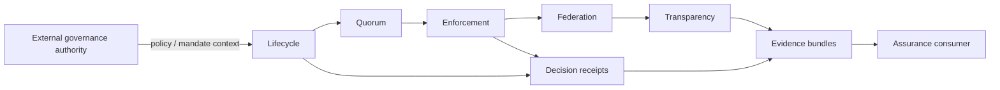
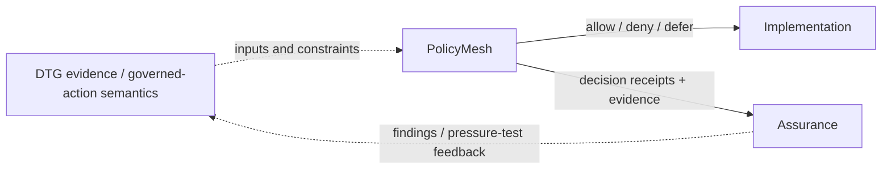

# Architecture

PolicyMesh separates **external governance authority** from **policy execution**. It receives policy and configured authority constraints, validates state transitions and approvals, distributes or reconciles state, makes bounded enforcement decisions, and produces evidence.

A peer, registry or imported artifact never gains authority merely because it is reachable. Local configured governance rules determine whether incoming state can be applied.

## DTG interoperability boundary

PolicyMesh can sit adjacent to Decentralized Trust Graph (DTG) specifications and implementations as an executable-policy and assurance laboratory. DTG artifacts can supply evidence, governed-action semantics, ceremony outcomes, or authority constraints; PolicyMesh evaluates **locally authoritative policy** and produces decision evidence. This is an interoperability relationship, not a normative dependency.

See [PolicyMesh and DTG](interoperability/dtg.md) for the detailed cross-workstream model and explicit non-authority boundaries.
