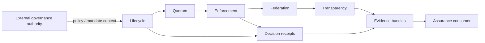

# Architecture

PolicyMesh separates **external governance authority** from **policy execution**. It receives policy and configured authority constraints, validates state transitions and approvals, distributes or reconciles state, makes bounded enforcement decisions, and produces evidence.

A peer, registry or imported artifact never gains authority merely because it is reachable. Local configured governance rules determine whether incoming state can be applied.
