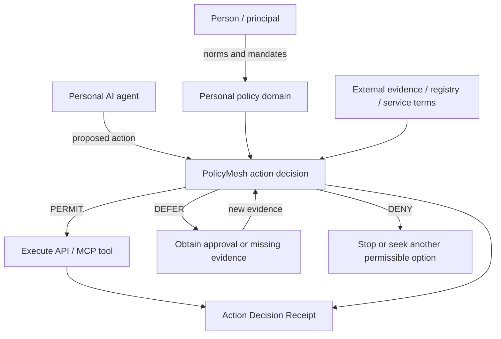

# PolicyMesh for personal-agent governance

A personal AI agent may be technically capable of taking an action without being authorised to create its consequences. PolicyMesh provides a boundary where a proposed action is evaluated against the user's declared policy, the agent's mandate, external evidence and the current context before execution.

> **Capability is not authority.** PolicyMesh answers whether this agent, acting for this principal, may perform this particular action under the evidence and policy currently available.

## Core interaction



PolicyMesh does not need to be the AI runtime, identity wallet, delegation protocol, registry, payment service or domain API. Those systems remain authoritative for their own facts. PolicyMesh consumes verified outputs and evaluates locally applicable rules.

## Consequence ladder

Personal-agent authority should normally become stricter as actions become more consequential:

1. **Observe** — read/search/retrieve information.
2. **Recommend** — rank or suggest options without external commitment.
3. **Prepare** — populate a form, basket, claim or transaction but do not submit it.
4. **Commit** — create contractual, financial, disclosure or other real-world consequences.

The worked examples place the strongest PolicyMesh gate at `commit`, while demonstrating that deployments can independently govern any level.

## PERMIT, DENY and DEFER

`PERMIT` means the currently presented policy and evidence authorise execution. `DENY` means a policy constraint is violated and the action should not execute. `DEFER` means the action is not yet authorised but additional evidence or authority could make it permissible.

For personal agents, `DEFER` is especially important. A purchase above an autonomous limit, an unverified healthcare provider, missing claim evidence or sensitive disclosure without explicit consent should not be silently treated as either globally forbidden or automatically allowed. The agent can obtain the missing approval/evidence and ask PolicyMesh to evaluate again.

## Human approval as evidence

Human-in-the-loop interaction is not a special bypass. It is additional evidence. A safe pattern is:

```text
proposed action → DEFER → request approval → approval artifact → re-evaluate → PERMIT/DENY
```

The approval should be scoped to the material action details (amount, counterparty, data class, destination, expiry, etc.) so a permit cannot be replayed for a different commitment.

## Agent-to-agent negotiation

A denied candidate does not necessarily end the task. An agent may negotiate for a new candidate that fits policy. For example, a hotel offer may initially violate the user's rate ceiling, then satisfy price but fail refundability, and eventually become permissible after revised terms. PolicyMesh therefore acts as a **constraint oracle for negotiation** without becoming the negotiating agent.

Where both parties use policy domains, an executable agreement exists only in the intersection between what one side may request/accept and what the other may offer/commit.

## Reusable patterns demonstrated

- **Bounded delegated authority:** agent scope is narrower than agent capability.
- **Consequence-sensitive escalation:** higher-impact actions require stronger authority.
- **Revocable mandates:** previously permitted behavior fails closed after revocation.
- **Purpose-limited disclosure:** access to data does not imply authority to disclose it.
- **Evidence-gated progression:** missing registry, consent or claim evidence produces `DEFER`.
- **Decision replay and audit:** receipts preserve policy/evidence digests and rule outcomes.

## Worked examples

- [Travel & Hospitality](../examples/travel-hospitality.md)
- [Personal Shopping Agent](../examples/personal-shopping.md)
- [Healthcare Appointment & Consent](../examples/healthcare-agent.md)
- [Insurance Claim Agent](../examples/insurance-claim-agent.md)

Together they show PolicyMesh governing travel commitments, consumer purchases, sensitive information disclosure, and stateful claims/settlement workflows using the same action-decision substrate.
