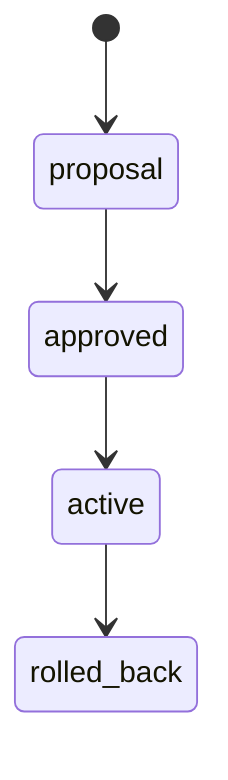

# Policy lifecycle

The v0.18.0 lifecycle is explicit and testable:

Invalid transitions fail. A lifecycle change invalidates signatures over the previous artifact representation, so the changed artifact must be re-signed. Rollback restores a retained historical policy as a **new** auditable act; it never erases intervening history.
