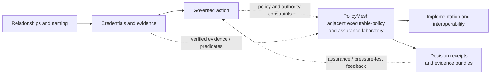
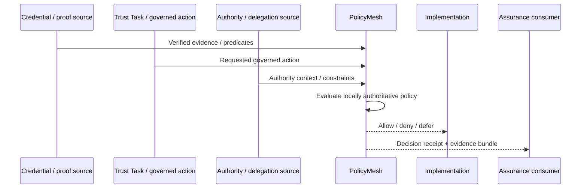
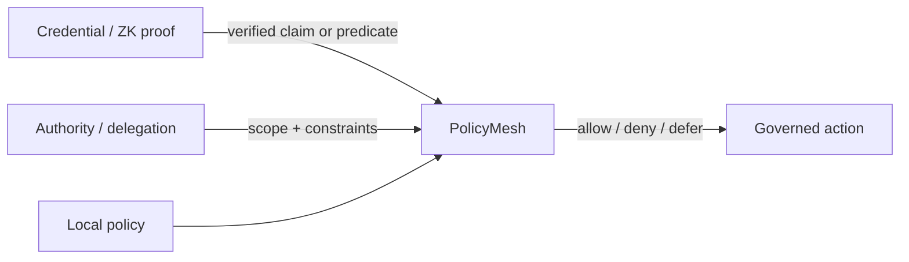
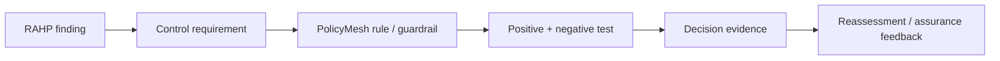

# PolicyMesh and the Decentralized Trust Graph work

PolicyMesh has a meaningful relationship to work occurring across the Trust over IP Decentralized Trust Graph (DTG) domain, but the relationship is deliberately **non-normative**.

PolicyMesh is **not** a DTG protocol, DTG governance authority, authorization specification, or official DTG implementation. It is an independent executable-policy and assurance implementation that can be used to **operationalize and pressure-test governance semantics** emerging from DTG specifications and implementations.

The practical boundary is:

> **DTG work can define evidence, relationships, governed actions, ceremonies, and assurance expectations. PolicyMesh can consume those inputs, evaluate locally authoritative policy, and retain evidence of the resulting policy decision.**

## Where PolicyMesh fits

PolicyMesh maps most strongly to **Governed action** and **Implementation and interoperability**, with secondary relationships to **Credentials and evidence** and assurance work. These labels are used as an analytical bridge to the DTG Portfolio Monitor; they do not make PolicyMesh part of an official DTG architecture.

## Cross-workstream relationships

| DTG workstream | PolicyMesh relationship | Boundary |
|---|---|---|
| Trust Tasks | Exercises governed-action semantics by evaluating whether local policy permits a requested consequential action | PolicyMesh does not redefine Trust Task semantics |
| Trust Ceremonies | Can consume ceremony receipts or outcomes as policy evidence | PolicyMesh does not determine whether the ceremony model itself is authoritative |
| Credential Specification | Can consume verified credential-derived claims or predicates when evaluating policy | Possessing a credential does not automatically create authorization |
| ZKP work | Can consume verified predicates while minimizing disclosure of underlying data | PolicyMesh verifies or receives proof results according to configured integrations; it does not define the ZKP scheme |
| RAHP | Provides an execution surface on which risk/guardrail findings can become testable controls | RAHP remains responsible for its risk-and-harm methodology |
| VDS work | Can use verifiable data structures to strengthen integrity and provenance of state/evidence | PolicyMesh does not redefine upstream VDS semantics |
| OpenVTC and other implementations | Can provide a reusable local policy gate and decision-evidence layer | Integration does not make PolicyMesh a required DTG component |

## Governed-action pattern

A useful separation of concerns is:

This preserves several distinctions that are easy to collapse in implementation:

**identity ≠ evidence ≠ authority ≠ delegation ≠ permission ≠ policy decision**

PolicyMesh is concerned primarily with the final policy-decision step and with preserving the evidence that explains it.

## Trust Tasks and ceremonies

Trust Tasks and ceremony work are especially strong interoperability candidates because they describe consequential action and governance-sensitive interactions.

A PolicyMesh integration could evaluate conditions such as:

- whether the requested task is within an actor's delegated scope;
- whether required ceremony evidence is present;
- whether the mandate remains valid and unrevoked;
- whether quorum or local policy constraints are satisfied;
- whether an execution would be a prohibited replay or duplicate;
- whether time, purpose, resource, or jurisdiction constraints still hold.

The resulting decision remains a **PolicyMesh local-policy decision**. It does not turn PolicyMesh into the source of the task, ceremony, delegation, or external authority.

## Credentials and ZK proofs as policy inputs

A credential or proof can establish evidence without itself deciding authorization.

This makes PolicyMesh a useful environment for testing whether a DTG workflow can reach a policy decision using the **minimum evidence necessary**, including privacy-preserving predicates rather than unnecessary source data.

## RAHP and executable assurance

RAHP and PolicyMesh have a complementary relationship:

This creates an executable feedback loop:

**finding → control → enforcement → evidence → reassessment**

It also exposes specification ambiguity. If a normative statement such as "the actor MUST have sufficient authority" cannot be translated into testable inputs, decision rules, revocation semantics, and evidence expectations, PolicyMesh has revealed an implementation gap rather than silently inventing the missing semantics.

## What this relationship does not imply

PolicyMesh does **not** assert that it is:

- part of an official DTG architecture;
- a DTG normative dependency;
- a canonical DTG policy engine;
- an authorization standard;
- a replacement for Trust Tasks, ceremonies, credentials, ZKP, RAHP, VDS, or OpenVTC;
- evidence that any DTG specification or implementation is conformant.

The relationship is best described as:

> **PolicyMesh is an adjacent executable-policy and assurance laboratory that can operationalize, integrate, and pressure-test governance semantics emerging across DTG workstreams while preserving the authority of those workstreams over their own specifications and artifacts.**

## Related resources

- [DTG Portfolio Monitor](https://sankarshanmukhopadhyay.github.io/dtg-portfolio-monitor/)
- [DTG domain model](https://sankarshanmukhopadhyay.github.io/dtg-portfolio-monitor/domain-model/)
- [PolicyMesh architecture](../architecture.md)
- [Authority boundaries](../concepts/authority-boundaries.md)
- [Agentic-system interoperability](agentic-systems.md)
- [Evidence bundles](../assurance/evidence-bundles.md)
