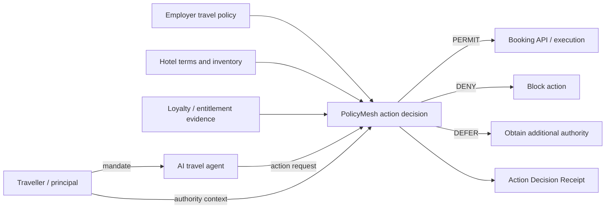

# Travel & Hospitality reference example

This example demonstrates PolicyMesh as a governed decision point for an **autonomous corporate hotel-booking agent**. It is deliberately synthetic and runs fully offline: no hotel API, payment provider, wallet, credential issuer or external registry is required.

## The question being evaluated

> Is this agent authorised, on behalf of this traveller, to make this exact hotel commitment, with this provider, at this price and under these terms, given the policy and evidence currently available?

PolicyMesh does not create the traveller's identity, the employer's legitimacy, the agent mandate, hotel inventory or loyalty entitlement. Those remain external facts. The example shows how those facts can be supplied to a locally authoritative policy decision and retained in a verifiable decision receipt.

## Actors

| Actor | Role |
| --- | --- |
| Priya | traveller and principal |
| `travel-agent-01` | delegated autonomous booking agent |
| Acme Corporation | employer and travel-policy authority |
| Harbour Hotel Singapore | accommodation supplier |
| ExampleStay | synthetic loyalty programme |

## What runs

The example exercises two PolicyMesh layers:

1. `norms/node-governance.norms.json` is compiled with the PolicyMesh norm compiler to establish controls for the PolicyMesh node itself.
2. `policy/corporate-hotel-booking.action-policy.json` is evaluated against an action request, evidence and authority context to produce `permit`, `deny` or `defer` plus an integrity-verifiable Action Decision Receipt.

This distinction is intentional: **node governance policy** controls how PolicyMesh operates; **application action policy** controls whether a specific business action may proceed.

## Run it

From the repository root:

```bash
python examples/travel-hospitality/run.py permitted-booking
```

Run every scenario:

```bash
python examples/travel-hospitality/run.py all
```

Or use the wrapper:

```bash
./examples/travel-hospitality/run.sh supplier-repriced
```

The CLI primitive used by the example is also available directly:

```bash
links action evaluate \
  examples/travel-hospitality/policy/corporate-hotel-booking.action-policy.json \
  examples/travel-hospitality/requests/permitted-booking.json \
  examples/travel-hospitality/evidence/base.json \
  --authority-context examples/travel-hospitality/authority/active-mandate.json \
  --out artifacts/action-decisions/travel-permitted.json

links action verify-receipt artifacts/action-decisions/travel-permitted.json
```

## Scenarios

| Scenario | Expected | Why |
| --- | --- | --- |
| `permitted-booking` | PERMIT | mandate, supplier, rate, refundability and financial limits all pass |
| `manager-approval-required` | DEFER | nightly rate exceeds autonomous limit, so additional authority is required |
| `supplier-repriced` | DEFER | supplier price changes before commitment and crosses the autonomous limit |
| `non-refundable-rate` | DENY | corporate policy requires refundable rates |
| `unapproved-hotel` | DENY | supplier is outside the approved hotel list |
| `revoked-mandate` | DENY | authority is no longer active |
| `paid-upgrade-out-of-scope` | DENY | the agent is capable of requesting an upgrade but is not delegated that action |

## Architecture



## Why `DEFER` matters

A deferred action is not necessarily forbidden. It means the evidence or authority currently available is insufficient to permit it. In the repricing scenario, the booking remains potentially valid but now requires manager approval because the nightly rate crossed the autonomous threshold.

This lets an agent distinguish **not allowed** from **not yet authorised**.

## What this example proves

The example makes five PolicyMesh properties concrete:

- capability is not authority;
- authority attaches to a particular scope, principal, actor and action;
- independently supplied policy and evidence can be evaluated without PolicyMesh claiming to issue them;
- a material change such as repricing requires a new decision rather than reusing an old permit;
- each decision can leave behind a deterministic evidence artifact suitable for review and replay.

## What is intentionally simulated

The first version keeps all inputs local so the example remains reproducible. A later interoperability profile can replace individual fixtures with real external systems without changing the decision boundary:

- identity or employment credentials for traveller/employer relationship;
- a mandate or delegation protocol for agent authority;
- hotel/OTA sandbox inventory and reservation APIs;
- registry evidence for approved suppliers;
- loyalty credentials for entitlements;
- MCP or A2A tool calls for `search`, `book`, `modify` and `cancel` operations;
- payment authorisation and settlement systems.

The correct integration pattern is to replace evidence providers one at a time, not to make PolicyMesh itself become the identity, registry, mandate, booking or payment system.
